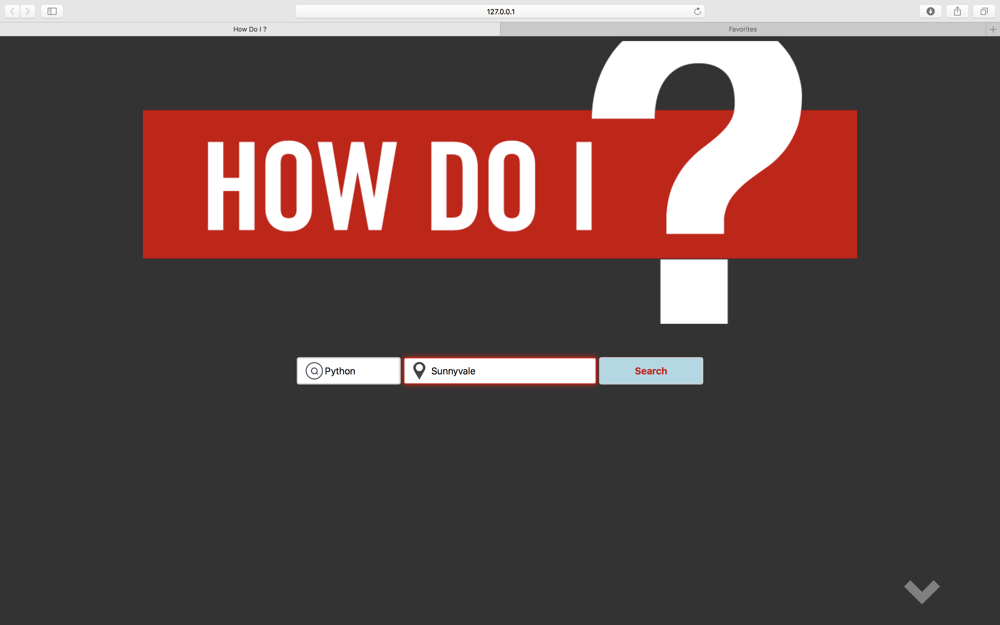
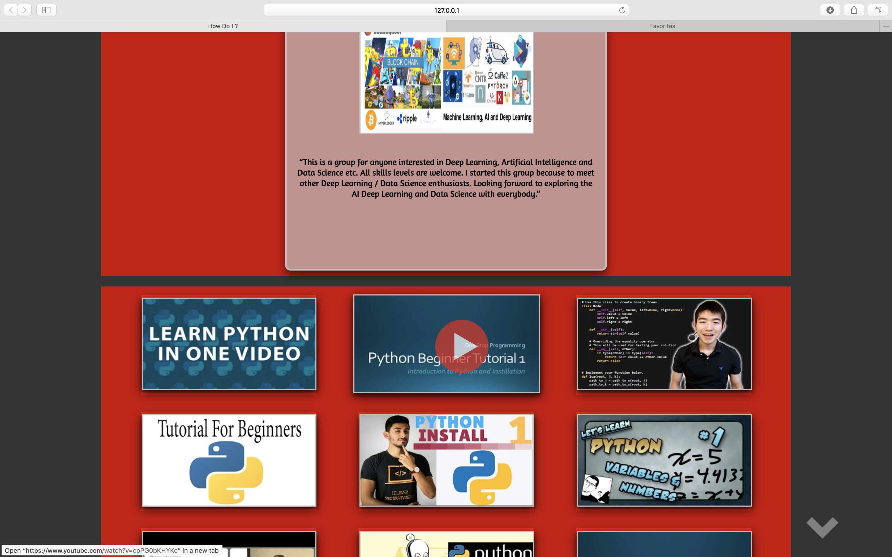
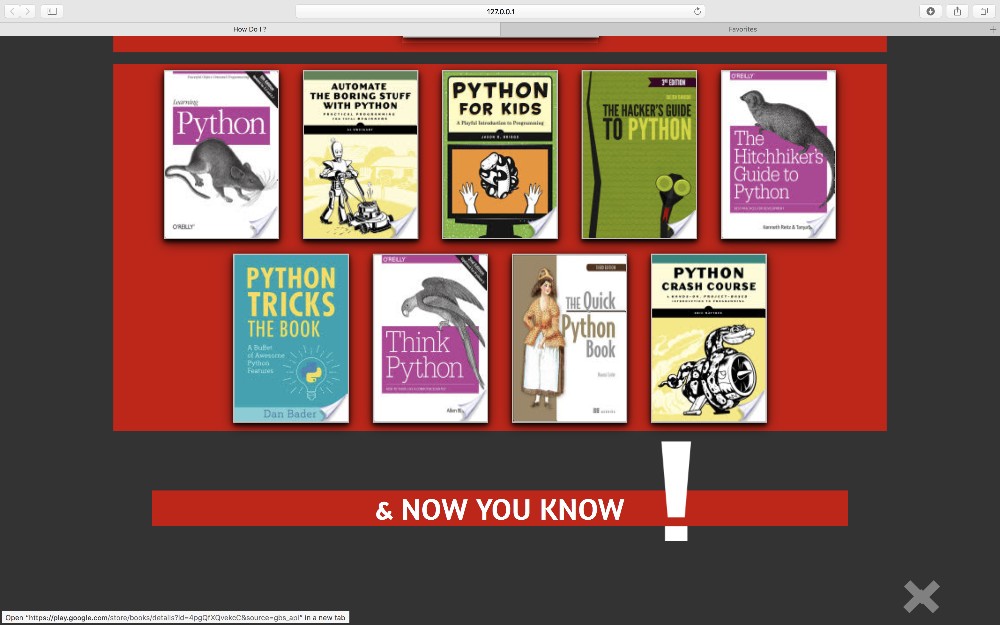

# How-Do-I.IO

A search page for the three main methods of learning. Users can enter a search term they wish to learn and recieve results including videos, groups, and books to learn from.

## Inspiration

I found myself searching Google for book recommendations, then searching for events for like-minded people and watching videos online that were related to whatever it was I was learning. Shouldn't there be a site for this? 

## Screenshots
Landing Page:

Video and MeetUP results:

Book results:

## Summary

How Do I is an interactive Web Application that allows you to search for Books, Videos and local event groups related to whatever it is you wish to learn. 

### Technology Used

Javascript, jQuery, HTML, CSS, Youtube Data API, Google Books API, and MeetUp API

### Live Link:
https://tone2k.github.io/How-Do-I/
