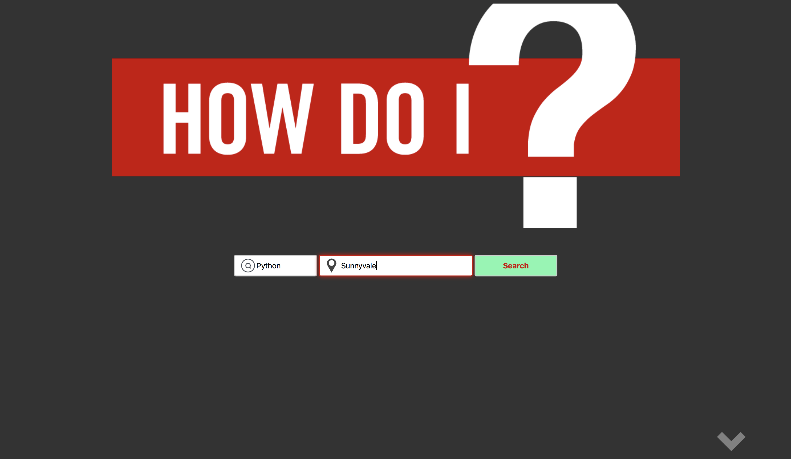
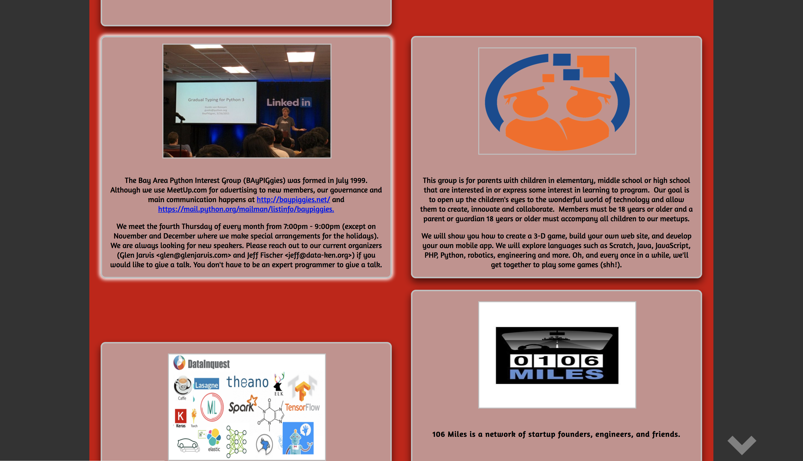
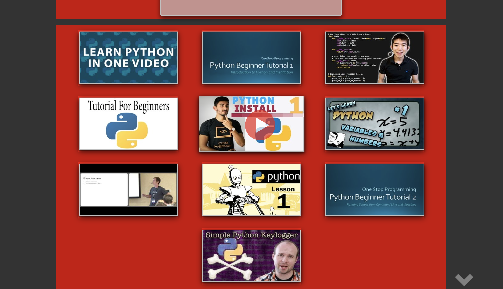
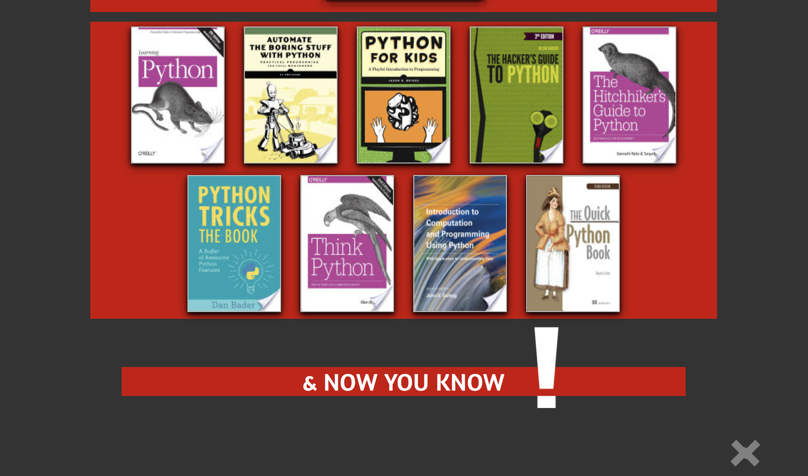
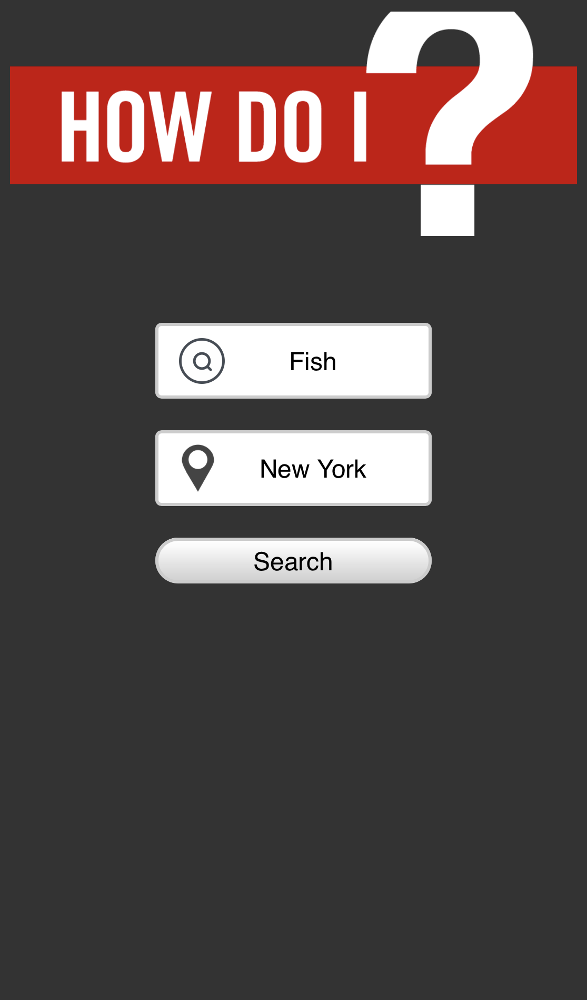

# How-Do-I.IO

A search page for the three main methods of learning. Users can enter a search term they wish to learn and recieve results including videos, groups, and books to learn from.

## Inspiration

I found myself searching the internet for book recommendations, how-to videos online or for events with like-minded people that I could potentially learn from all the time. Through hopping back and forth between different sites and searches, I decided building one site with one search could really help.  

## Screenshots
Landing Page:

MeetUP results:

Video results:

Book results:

Mobile View:

## Summary

How Do I is an interactive Web Application that allows you to search for Books, Videos and local event groups related to whatever it is you wish to learn. 

### Technology Used

Javascript, jQuery, HTML, CSS, Youtube Data API, Google Books API, and MeetUp API

### Live Link:
https://tone2k.github.io/How-Do-I/
